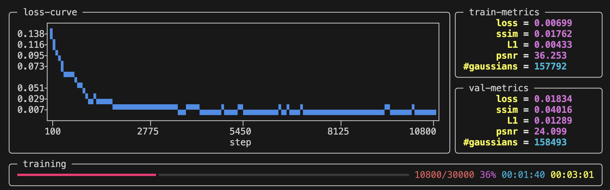

# **Quickstart**

We are going to start from a simple example with the scene `data/blender/lego` , where a [3D Gaussian Splatting](https://github.com/graphdeco-inria/gaussian-splatting) model will be trained, tested, exported and visualized. You can find code from [RadianceFieldStudio/examples/quickstart](https://github.com/PKU-VCL-Geometry/RadianceFieldStudio/tree/master/examples/quickstart) .


## **1. Data Preparation**

Download NeRF Synthetic Dataset from [HuggingFace Repository](https://huggingface.co/datasets/jkulhanek/nerfbaselines-data) maintained by [NerfBaselines](https://nerfbaselines.github.io/) .

```pshell
cd RadianceFieldStudio
python scripts/data/download.py blender --scene lego --use-proxy # Use proxy for Chinese users
```

You will get Lego now: `data/blender/lego` .

## **3. Train a 3DGS**

The script `examples/quickstart/01_train_3dgs.py` provides code for 3DGS training:

```py title="examples/quickstart/01_train_3dgs.py" linenums="1"
--8<-- "examples/quickstart/01_train_3dgs.py"
```

Run the script in your terminal and you can watch progress from the terminal:

```pshell
python train.py \
    --dataset.path data/blender/lego \
    --experiment.name test
```



## **4. Check Training Results**

After training for ~5min, the task will be done and you can use ++ctrl+c++ to exit.

The related training results will be dumped at `#!sh outputs/test/${timestamp}` :

+ **Checkpoints**: Model weights are saved at `#!sh outputs/test/${timestamp}/ckpts` .

+ **Validation**: novel views as well as their ground truth are rendered at `#!sh outputs/test/${timestamp}/dump/val` .

+ **Log**: training details will be logged at `#!sh outputs/test/${timestamp}/log.txt` .

+ **Arguments**: training arguments will be automatically generated at `#!sh outputs/test/${timestamp}/task.py` . (1) 
{ .annotate }

    1.  It enables you to rerun an experiment with the completely same arguments, simply by:

        ```pshell
        python outputs/test/${timestamp}/task.py
        ```

## **5. Write Your First Script**

In [Section 3](#3-train-a-3dgs), we have run an existing train script. Next, we are now going to write our own script from scratch.

### 5.1 Hello World

Create a new script named `test.py` and start with `Hello World` :

=== "test.py"

    ```py linenums="1"

    def run():
        print('Hello World!')

    if __name__ == '__main__':
        run()
    ```

=== "Run & Results"

    ```psession
    $ python test.py
    Hello World!
    ```

### 5.2 Start From Task

The above script succeed in executing the main function `run` . Similarly, Radiance Field Studio abstracts any executable script into a `Task` class, which always has a `run` method as the entry point of the script. Users need to import the `Task` class as a base class and override its `run` method through inheritance:

=== "test.py"

    ```py linenums="1"
    from dataclasses import dataclass
    from rfstudio.engine.task import Task


    @dataclass                     # dataclass decorator is a must
    class Tester(Task):
        def run(self) -> None:
            print('Hello World!')


    if __name__ == '__main__':
        tester = Tester()
        tester.run()

    ```

=== "Run & Results"

    ```psession
    $ python test.py
    Hello World!
    ```

### 5.3 CLI Support

One of the advantages of doing this is that Radiance Field Studio provides convenient command-line support based on [tyro](https://github.com/brentyi/tyro). The dataclass decorator is used to add fields to this class, after which these fields will be automatically recognized:


=== "test.py"

    ```py linenums="1"
    from dataclasses import dataclass
    from rfstudio.engine.task import Task


    @dataclass                     # dataclass decorator is a must
    class Tester(Task):

        num_a: int = ...           # ellipsis means "required"
        num_b: int = 6             # default value is 6
        num_c: int = ...           # ellipsis means "required"
        info: str = 'Hello World!' # default value is 'Hello World!'

        def run(self) -> None:
            print(self.info)       # use self.${field} to access any field
            print(f'{self.num_a + self.num_b + self.num_c = }')


    if __name__ == '__main__':
        tester = Tester()
        tester.run()

    ```

=== "Run & Results"

    ```psession
    $ python test.py -h
    usage: test.py [-h] [OPTIONS]

    ╭─ options ─────────────────────────────────────────────────────────────────────────╮
    │ -h, --help              show this help message and exit                           │
    │ --seed {None}|INT       (default: None)                                           │
    │ --cuda {None}|INT       (default: None)                                           │
    │ --num-a INT             ellipsis means "required" (required)                      │
    │ --num-b INT             default value is 6 (default: 6)                           │
    │ --num-c INT             ellipsis means "required" (required)                      │
    │ --info STR              default value is 'Hello World!' (default: 'Hello World!') │
    ╰───────────────────────────────────────────────────────────────────────────────────╯
    $ python test.py --num-a 1 --num-c 3
    Hello World!
    self.num_a + self.num_b + self.num_c = 10
    $ python test.py --num-a 1 --num-c 3 --num-b 9 --info "Good Morning\!"
    Good Morning!
    self.num_a + self.num_b + self.num_c = 13
    ```

### 5.4 Edit Argument

Before we call `run` function to execute the task, it is possible for us to explicitly initialize the arguments or dynamically modify them:

=== "test.py"

    ```py linenums="18"
    if __name__ == '__main__':
        tester = Tester(num_c=9, info=...)
        tester.num_b = 7
        tester.run()
    ```

=== "Run & Results"

    ```psession
    $ python test.py -h
    usage: test.py [-h] [OPTIONS]

    ╭─ options ──────────────────────────────────────────────────────────╮
    │ -h, --help              show this help message and exit            │
    │ --seed {None}|INT       (default: None)                            │
    │ --cuda {None}|INT       (default: None)                            │
    │ --num-a INT             ellipsis means "required" (required)       │
    │ --num-b INT             default value is 6 (default: 7)            │
    │ --num-c INT             ellipsis means "required" (default: 9)     │
    │ --info STR              default value is 'Hello World!' (required) │
    ╰────────────────────────────────────────────────────────────────────╯
    ```

### 5.5 Serialization & Deserialization

Radiance Field Studio provides APIs for serialization and deserialization of `Task`. For example, the class method `TrainTask.load_from_script` is used to deserialize `Task` object from `outputs/test/${timestamp}/task.py`, which is automatically generated in [Section 3](#3-train-a-3dgs) . We can use the API to build a simple tester.

=== "test.py"

    ```py linenums="1"
    --8<-- "examples/quickstart/02_load_3dgs.py"
    ```

=== "Run & Results"

    ```psession
    $ python test.py --load ./outputs/test/${timestamp}/task.py
    Result: #Gaussians = 116590
    ```

## **6. Test Your Model**

Rewrite `test.py` for pretrained model testing: (1)
{ .annotate }

1.  You can also find the code at [RadianceFieldStudio/examples/quickstart/03_test_3dgs.py](https://github.com/PKU-VCL-Geometry/RadianceFieldStudio/tree/master/examples/quickstart/03_test_3dgs.py) .


```py title="test.py" linenums="1"
--8<-- "examples/quickstart/03_test_3dgs.py"
```

Run the script and the results are:

```
Eval: loss=0.01009 psnr=33.638
```

## **7. Visualize 3DGS**

Create another script named `visualize.py` for visualization: (1)
{ .annotate }

1.  You can also find the code at [RadianceFieldStudio/examples/quickstart/04_visualize_3dgs.py](https://github.com/PKU-VCL-Geometry/RadianceFieldStudio/tree/master/examples/quickstart/04_visualize_3dgs.py) .


```py title="visualize.py" linenums="1"
--8<-- "examples/quickstart/04_visualize_3dgs.py"
```

Then, you can visualize 3DGS in the interactive web viewer.
